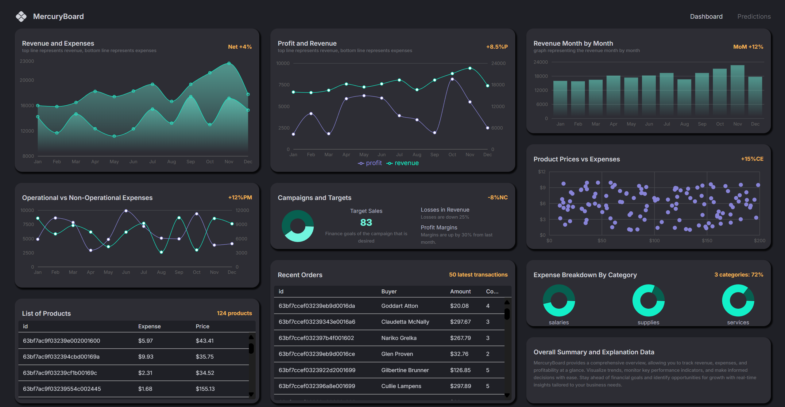
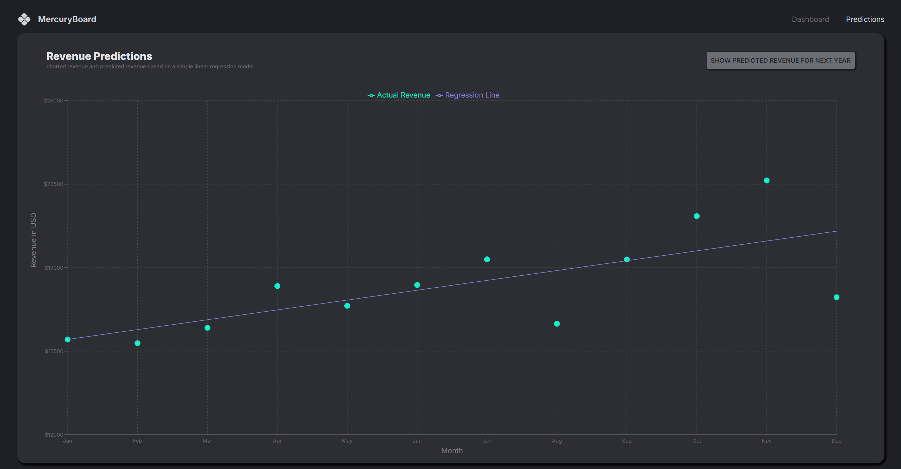
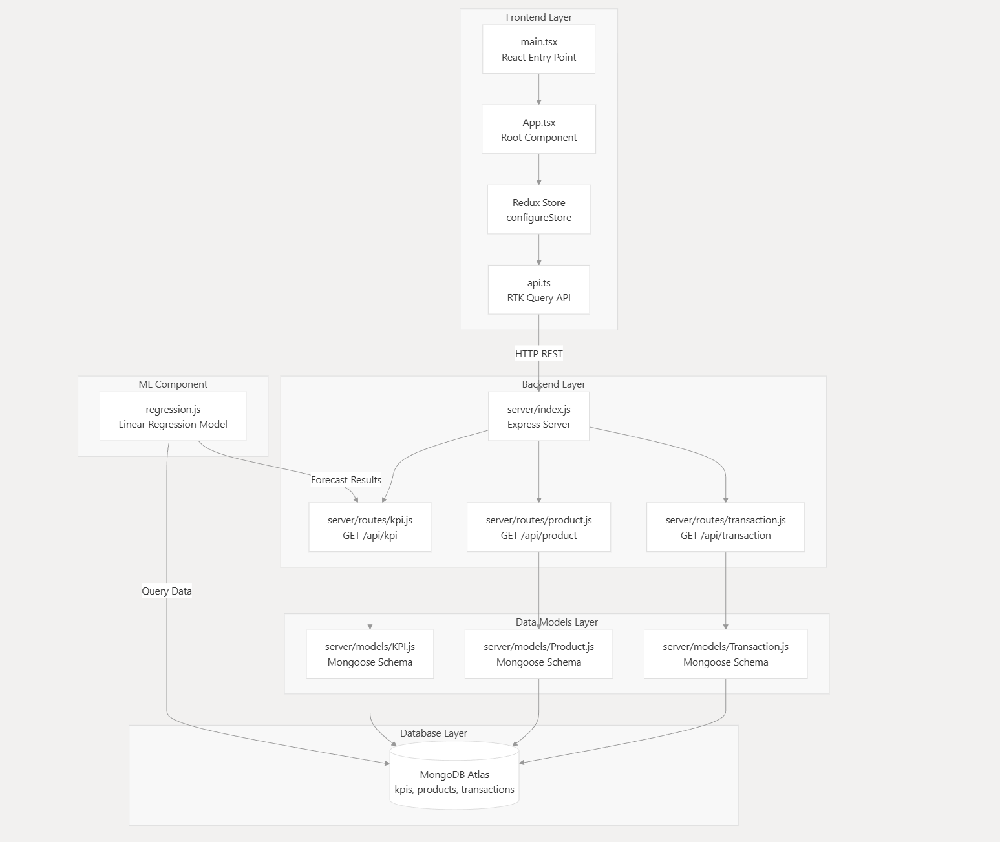
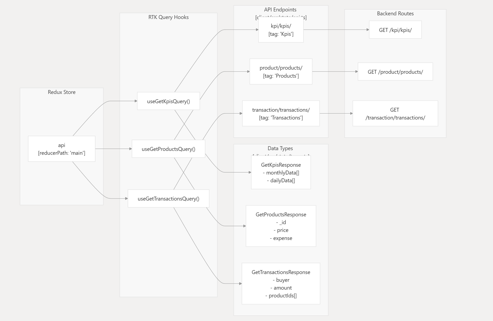

<!DOCTYPE html>
<html lang="en">
<body>

  <h1>AI-Finance Dashboard</h1>
  

    <strong>AI-Finance Dashboard:</strong> Built a full-stack responsive Financial Analytics Dashboard using KPI, product, and transaction models.
    Application was developed with <strong>React + TypeScript + Material-UI + Redux Toolkit</strong> on the frontend and <strong>Node.js/Express + MongoDB</strong> on the backend.
    It visualizes interactive charts (e.g., Profit and Revenue, Campaign and Target) using <strong>Recharts</strong> and leverages a <strong>Linear Regression Machine Learning model</strong> to forecast future company revenue, turning historical data into actionable insights for strategic decision-making.
  

<h2>📸 Dashboard Preview</h2>

  
  

    <h3>Dashboard Overview</h3>
    
  

  

    <h3>Prediction Analytics</h3>
    
  

  <h2>📊 Example Insights</h2>
  <ul>
    <li>Revenue vs Profit over time</li>
    <li>Revenue vs Expense over time</li>
    <li>operational vs non operational cost over time</li>
    <li>Revenue month by month trends over time</li>
    <li>Campaign performance vs target</li>
    <li>Future revenue forecasting with Linear Regression</li>
  </ul>

  <h2>🚀 Features</h2>
  <ul>
    <li>Responsive financial dashboard UI built with Material-UI</li>
    <li>KPI, products, and transactions data models with MongoDB</li>
    <li>Interactive data visualizations using Recharts</li>
    <li>Redux Toolkit for state management</li>
    <li>Backend APIs built with Express and Mongoose</li>
    <li>Machine Learning: Linear Regression for revenue forecasting</li>
  </ul>

  <h2>🛠️ Tech Stack</h2>
  <ul>
    <li><strong>Frontend:</strong> React, TypeScript, Material-UI, Redux Toolkit, Recharts</li>
    <li><strong>Backend:</strong> Node.js, Express.js, Mongoose</li>
    <li><strong>Database:</strong> MongoDB (Atlas)</li>
    <li><strong>Machine Learning:</strong> Linear Regression (JavaScript/ML integration)</li>
  </ul>

  <h2>📂 Project Structure</h2>
  <pre>
AI-Finance-Dashboard/
├── client/                 # Frontend (React + TypeScript)
│   ├── public/             # Static assets
│   ├── src/
│   │   ├── components/     # Reusable UI components
│   │   ├── features/       # Redux slices and state logic
│   │   ├── pages/          # Dashboard pages
│   │   ├── charts/         # Recharts components
│   │   └── App.tsx         # Main App entry
│   └── package.json
│
├── server/                 # Backend (Node.js + Express)
│   ├── models/             # Mongoose models (KPI, Products, Transactions)
│   ├── routes/             # Express routes (API endpoints)
│   ├── controllers/        # Business logic for APIs
│   ├── index.js            # Server entry point
│   └── package.json
│
├── README.html             # Project documentation
├── package.json            # Root config (optional for monorepo)
└── .gitignore
  </pre>

<h2>🏗️ Project Architecture & Data Flow</h2>

<h3>1️⃣ Architecture Diagram</h3>

<h3>2️⃣ Server Architecture</h3>

<h3>3️⃣ Data Flow Diagram</h3>

<h3>4️⃣ Database Tables</h3>

<h2>⚡ Getting Started</h2>

<ol>
  <li>
    <strong>Clone the repository:</strong> 
    <pre>git clone &lt;repository-url&gt;</pre>
  </li>

  <li>
    <strong>Set up environment variables:</strong> 
    For example: MongoDB URI, PORT
  </li>

  <li>
    <strong>Install dependencies:</strong>
    <pre>
cd client && npm install
cd ../server && npm install
    </pre>
  </li>

  <li>
    <strong>Run backend:</strong>
    <pre>cd server && npm run dev</pre>
  </li>

  <li>
    <strong>Run frontend:</strong>
    <pre>cd client && npm run dev</pre>
  </li>
</ol>

  <h2>🎯 Conclusion</h2>
  

    The AI-Finance Dashboard is a full-stack, data-driven application that turns historical financial data into actionable insights.
    It combines modern frontend technologies with a robust backend and machine learning forecasting, providing businesses with interactive analytics to support strategic decision-making.
  

</body>
</html>
